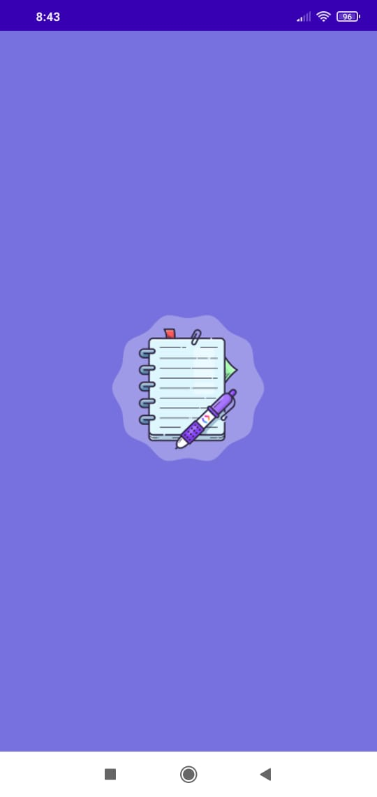
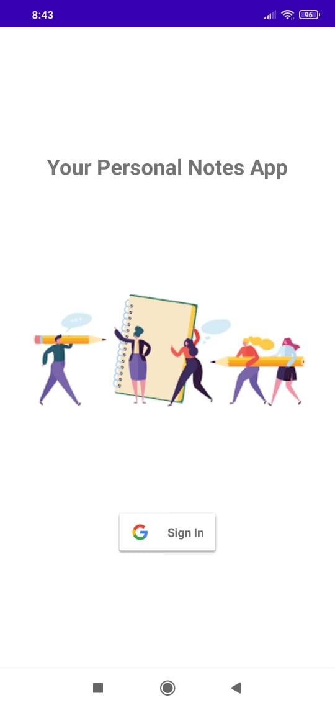
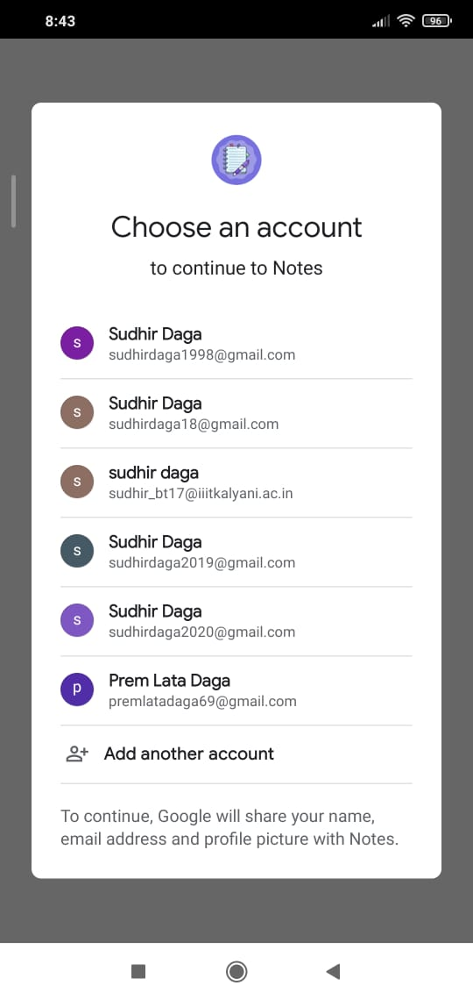
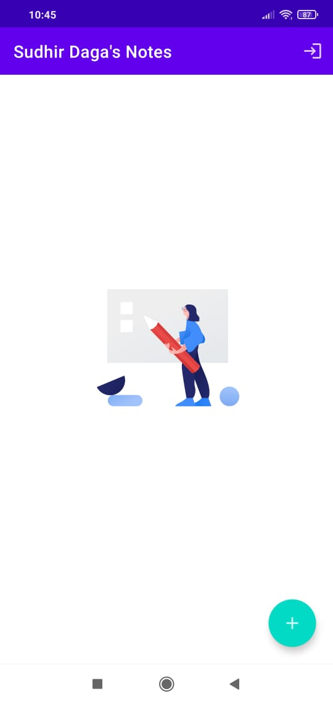
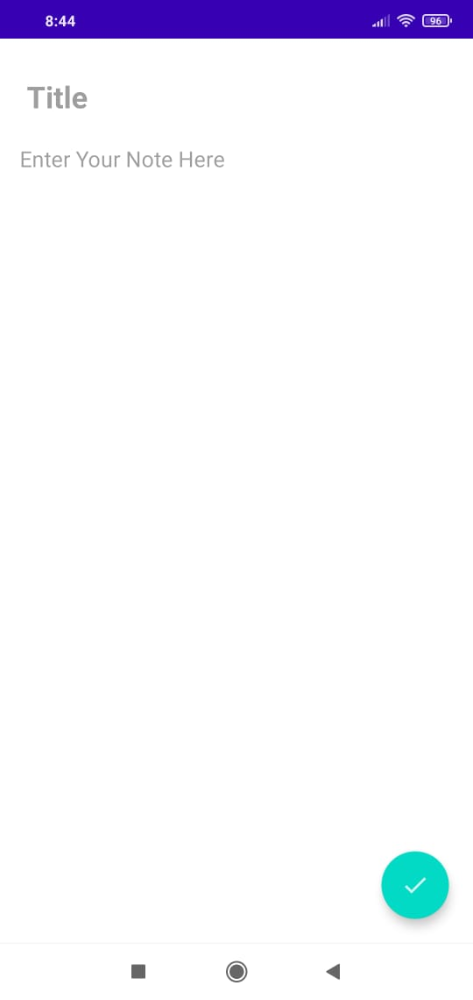
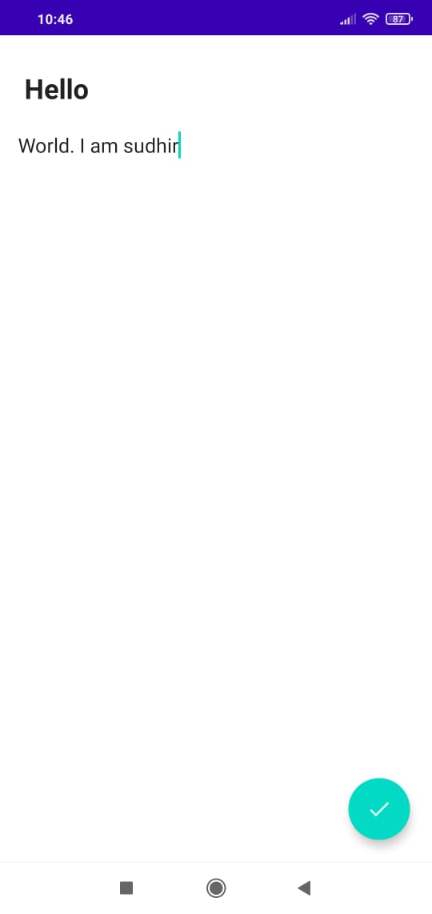
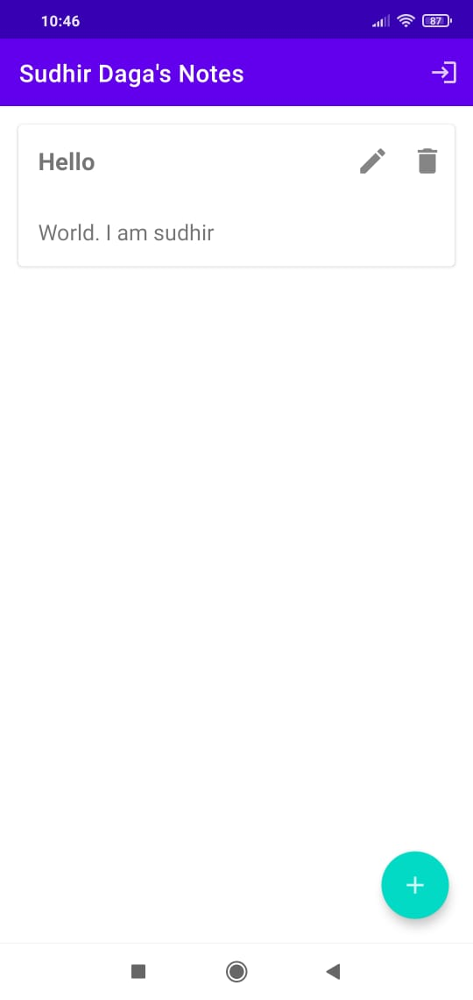

# Notes-App

Notes App with Google Sign In features and local database(Room) which stores your notes.

## Features of App

- Google Sign-In Authentication.
- Single Activity App Along With Fragments.
- Adds Notes on clicking plus button.
- Edit/Delete notes on clicking respective icons.
- Notes are stored locally using SQLite Room DB

## Some screenshots

         
   
